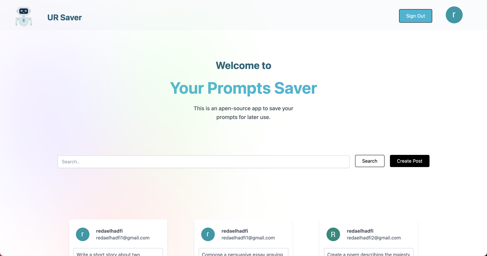

# AI Prompt Saver

## Description

AI Prompt Saver is a web app that helps developers save and organize their AI-generated prompts. With this tool, you can save and share ur prompts.

## Features

- Save prompts to a database
- View  saved prompts

## Technologies
- [next.js](https://nextjs.org/)  
- [React](https://reactjs.org/)
- [Node.js](https://nodejs.org/en/)
- [MongoDB](https://www.mongodb.com/)
- [next-auth](https://next-auth.js.org/)
- [Tailwind CSS](https://tailwindcss.com/)

## screenshots
 

## App Link
- [link to the app](https://ai-prompts-saver.vercel.app/)

## Contributing

If you would like to contribute to AI Prompt Saver, follow these steps:

1. Fork the repository
2. Create a new branch: `git checkout -b feature/your-feature-name`
3. Make changes and commit them: `git commit -m "your commit message"`
4. Push to the branch: `git push origin feature/your-feature-name`
5. Submit a pull request

